# Encryption App (Wpf)

## Contexte : 

The idea for this project came to me while doing a mathematics assessment. There was an exercise where the goal was to encode and decode words:

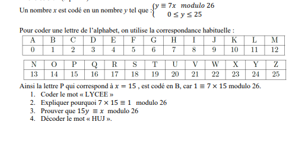

This application allows a user to generate a strong password and encrypt and decrypt messages using different encryption algorithms (modulo, Vigenère, and rotN, inspired by rot13).

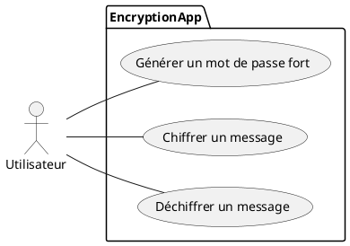
 

The main window :

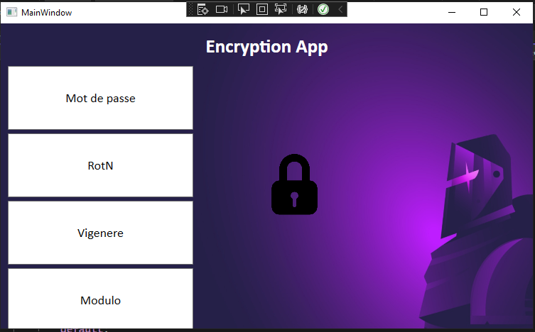

If I click on the 'Password' button, a message box will suggest a strong password :

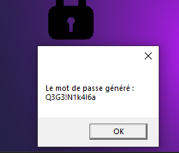

## The Different Encryption Techniques :

## Rot N :

ROT13 (rotate by 13 places) is a special case of the Caesar cipher, a simple text encryption algorithm. As its name suggests, it involves shifting each letter of the text to be encrypted by 13 characters.

I chose to customize this algorithm by giving the user the ability to encrypt or decrypt their message with a shift of their choice.

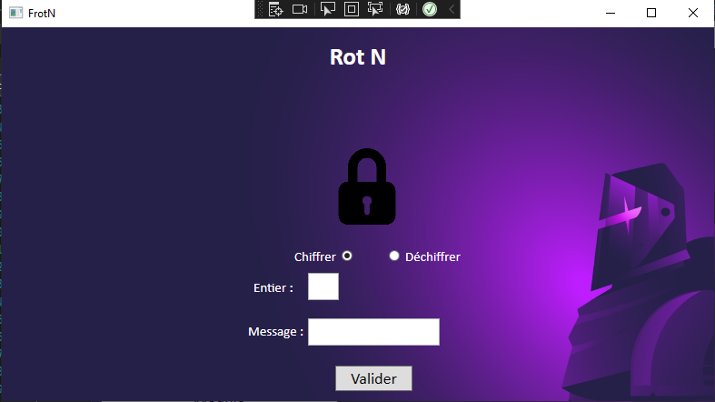

To test, I enter the message 'Hamster' with a shift of 3, the result should be 'Kdpvwhu':

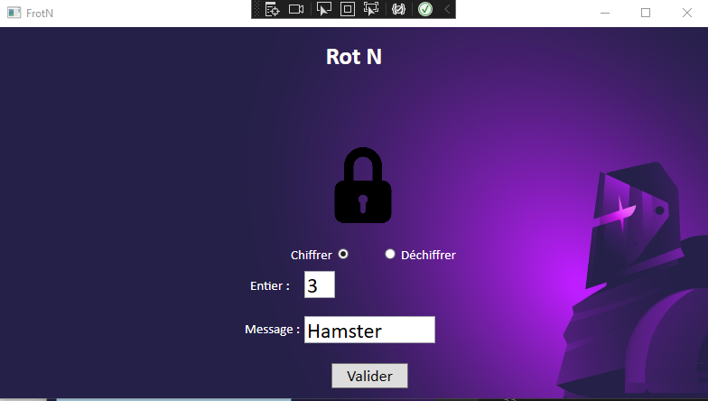

the final result is "Kdpvwhu" :

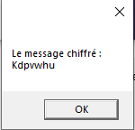

To decrypt, I choose the 'decrypt' option and enter :

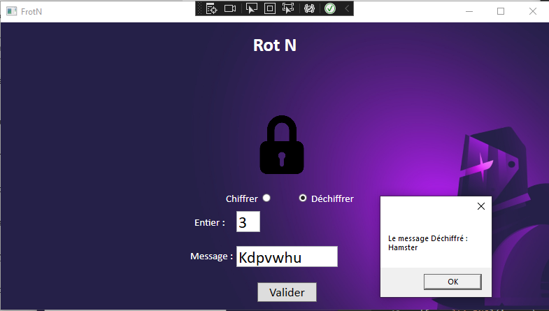

 

## Vigenère :

The Vigenère cipher is a polyalphabetic substitution encryption system in which the same letter in the plaintext can, depending on its position, be replaced by different letters.

 

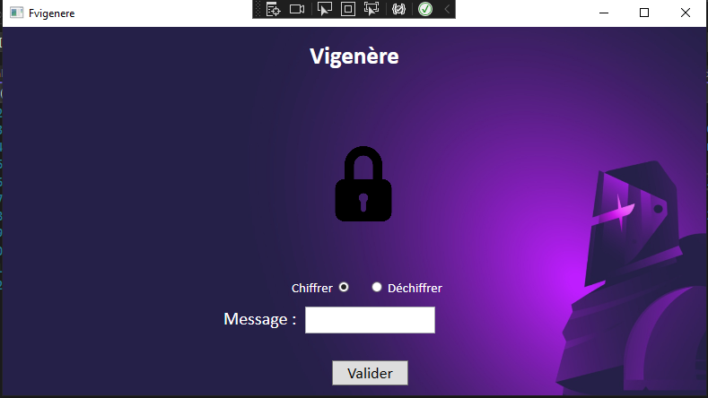

The message is encrypted using a key word, meaning the sum of the position of the letter in the alphabet with an offset of -1 (array/list starts at index 0) of the current character with the position of the corresponding character in the key.

In this situation, the key was DCODE

The positions :

* D = 3
* C = 2
* O = 13
* D = 3
* E = 4

To encrypt the message "nuageux" using the Vigenère cipher with the key "DCODE", let's break down the steps :

* N+D=16=Q
* U+C=22=W
* A+O=14=O
* G+D=9=J
* E+E=8=I
* U+D=23=X
* X+C=25=Z

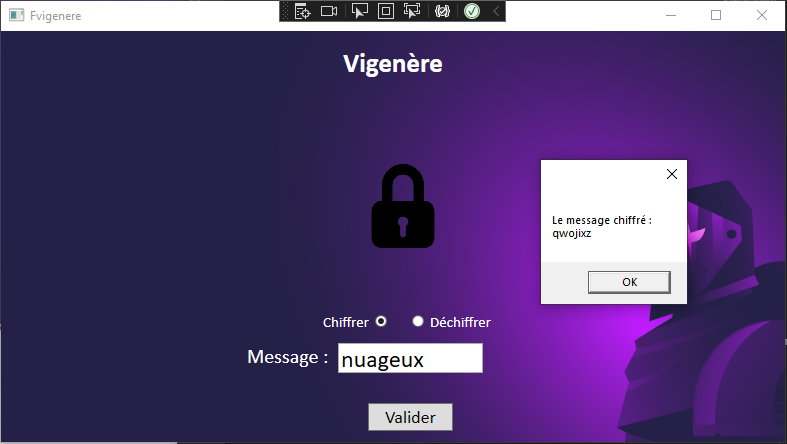

decrypt  :

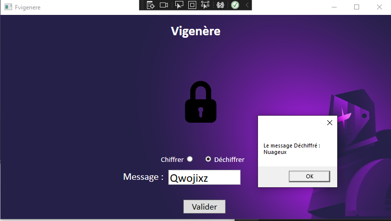

 

## Modulo :

For the last algorithm, it’s the one from the math exercise — the modulo. The result is equal to the position of the current letter * 7, divided by 26, and we keep the remainder of the division as the result.

For this situation, I will use the word Prog :

* B = 7 * 15 % 26
* p = 7 * 17 % 26
* u = 7 * 14 % 26
* q = 7 * 6 % 26

We must therefore obtain the word Bpuq after encrypting the message :

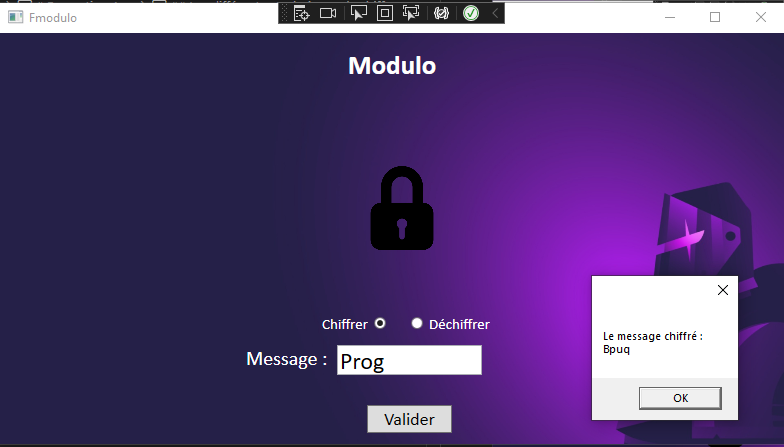

To decrypt the message :

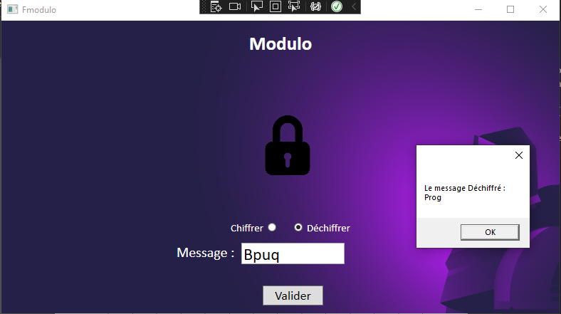

 

## Control the input :

Input controllers have been put in place :

- No characters entered :

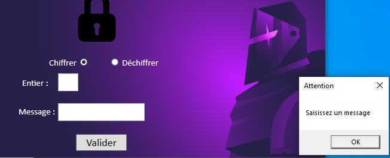

- Unauthorized characters :

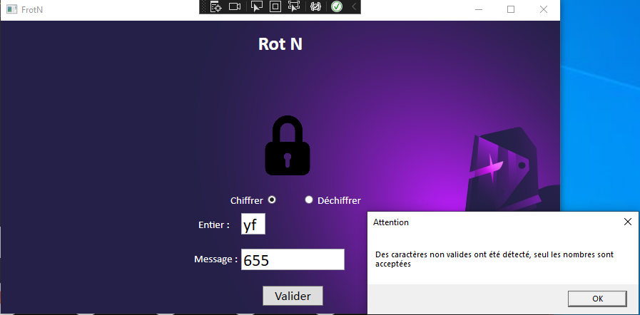

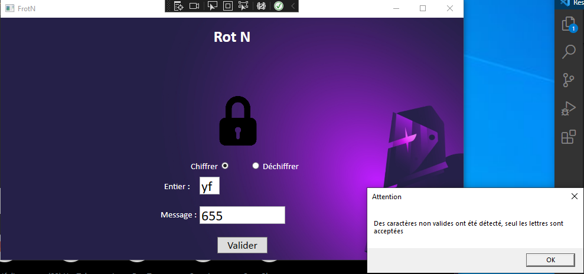
