# Encryption App (Wpf)
## Contexte : 
L'idée de ce projet, m'est venu en faisant une évaluation de mathématique, il y avait un exercice où le but était de coder et décoder des mots :

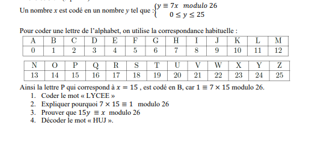

Cette application, permet à un utilisateur de générer un mot de passe fort et de chiffrer et déchiffrer des messages, grâce aux différents algorithmes de chiffrement (modulo,vigenère et rotN(inspiré du rot13)).

 
La fenêtre principale :

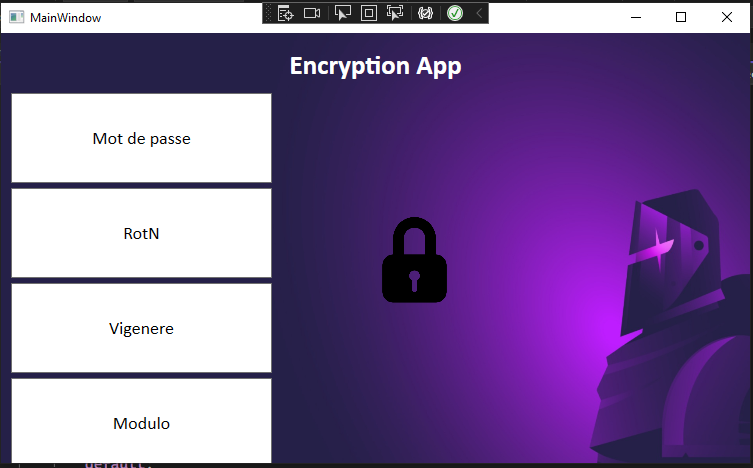

Si je clique sur le bouton Mot de passe une message Box me propose un mot de passe fort :

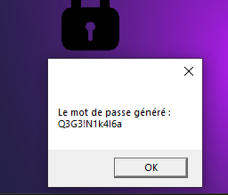

## Les différentes techniques de chiffrement :

## Rot N :

Le ROT13 (rotate by 13 places) est un cas particulier du chiffre de César, un algorithme simpliste de chiffrement de texte. Comme son nom l’indique, il s’agit d’un décalage de 13 caractères pour chaque lettre du texte à chiffrer.

J'ai fais le choix de personnaliser, cet algorithme en donnant la possibilité à l'utilisateur de chiffrer ou déchiffrer son message avec le décalage de son choix.

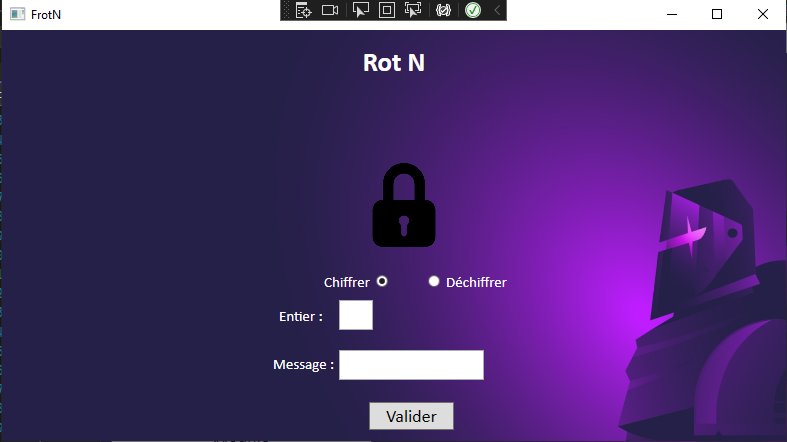

Pour tester, je saisis le message Hamster avec un décalage de 3 le résultat devrait être Kdpvwhu:

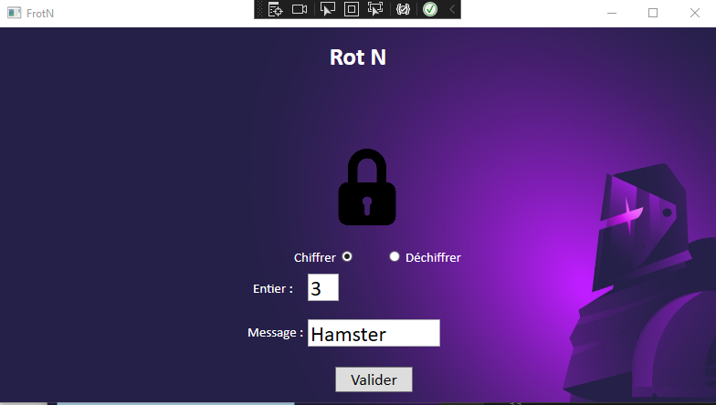

Le résultat :

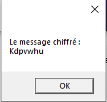

Pour déchiffrer je choisis l'option déchiffrer et je saisis :

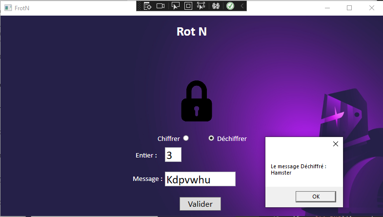

 

## Vigenère :

Le chiffre de Vigenère est un système de chiffrement par substitution polyalphabétique dans lequel une même lettre du message clair peut, suivant sa position dans celui-ci, être remplacée par des lettres différentes.

 

Le méssage se chiffre à l'aide d'une clé de mot c'est à dire la somme de la position de la lettre dans l'alphabet avec un décalage de -1 (array/list commence à l'index 0) du caractère en cours avec la position du caractère de la clé en cours.

Dans cette situation la clé était DCODE

Les positions :

* D = 3
* C = 2
* O = 13
* D = 3
* E = 4

Si je saisis le message "nuageux" le résultat devrait être qwojixz car :

* N+D=16=Q
* U+C=22=W
* A+O=14=O
* G+D=9=J
* E+E=8=I
* U+D=23=X
* X+C=25=Z

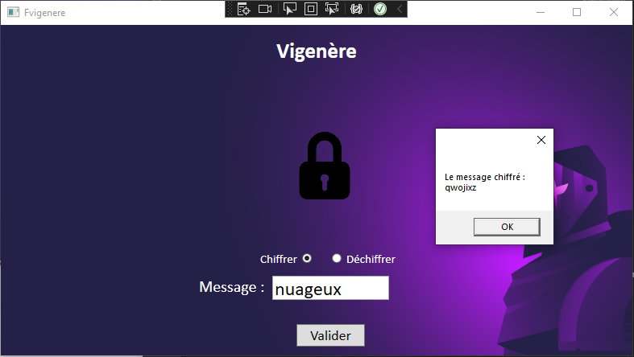

Le déchiffrement :

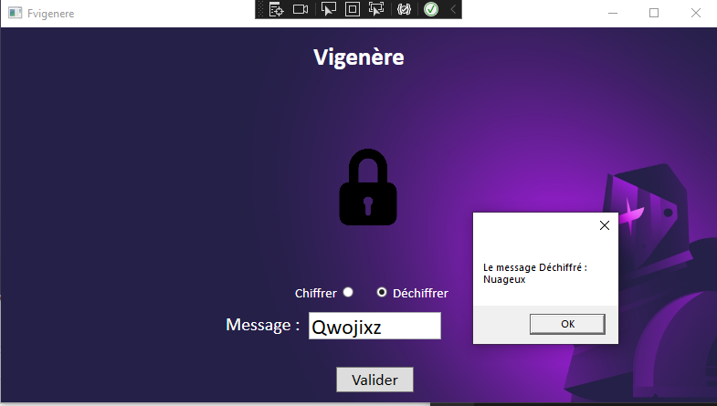

 

## Modulo :

Pour le dernier algorithme, c'est celui de l'exercice de mathématique le modulo.

Le résultat est égal à la position de la lettre en cours * 7 divisé par 26 et c'est le reste de la division que l'on garde comme résultat.

Pour cette situation je vais utiliser le mot Prog

* B = 7 * 15 % 26
* p = 7 * 17 % 26
* u = 7 * 14 % 26
* q = 7 * 6 % 26

Nous devons donc obtenir le mot Bpuq après le chiffrement du message.

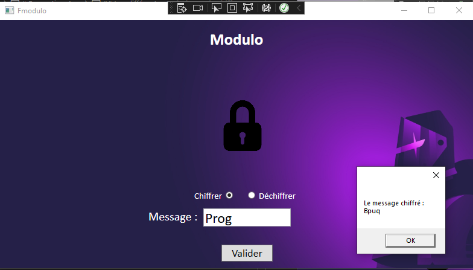

Le déchiffrement du message :

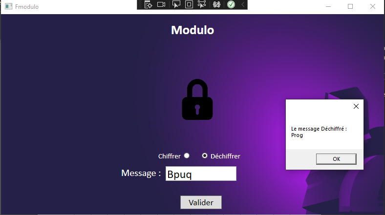

 

## Contrôller la saisie :

Des controlleurs de saisie ont été mis en place :

- Aucun caractères saisie :
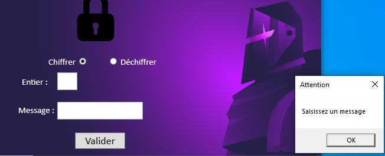

- Caractères non autorisé :

Mail développeur : enstso@outlook.fr